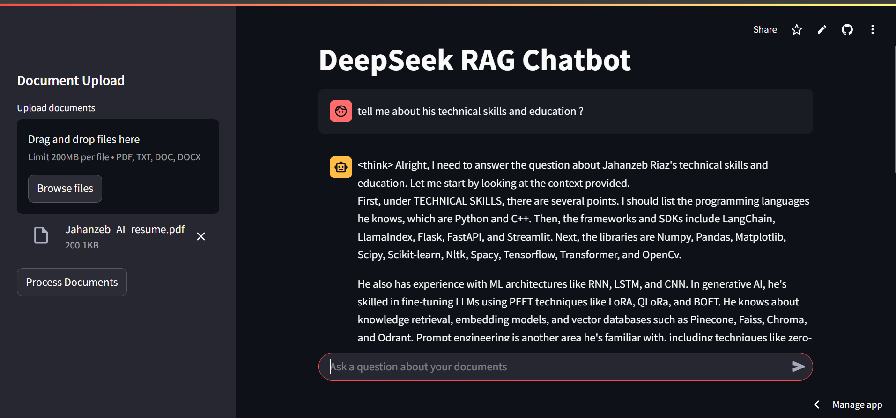

# **DeepSeek RAG Chatbot**

🚀 **An advanced Retrieval-Augmented Generation (RAG) chatbot leveraging DeepSeek models for document-based Q&A.**



## **📌 Overview**
The **DeepSeek RAG Chatbot** is an AI-powered chatbot that enables users to upload documents (PDF, TXT, DOC, DOCX) and ask context-aware questions. It retrieves relevant information using **RAG (Retrieval-Augmented Generation)** and provides insightful responses based on document content.

## **🛠️ Tech Stack**
- **Model:** DeepSeek LLM  
- **Frameworks:** LangChain, Streamlit  
- **Vector Database:** FAISS  
- **Embeddings:** Google GenerativeAI Embeddings  
- **Libraries:** PyPDF2,   

## **✨ Features**
✅ Upload multiple document formats (PDF, TXT, DOC, DOCX)  
✅ Context-aware Q&A using DeepSeek model  
✅ Real-time document processing and retrieval  
✅ Interactive UI built with Streamlit  

## **📂 Installation**
1. **Clone the repository**  
   ```bash
   git clone https://github.com/yourusername/deepseek-rag-chatbot.git
   cd deepseek-rag-chatbot
   ```
2. **Install dependencies**  
   ```bash
   pip install -r requirements.txt
   ```
3. **Run the chatbot**  
   ```bash
   streamlit run app.py
   ```

## **🚀 Usage**
1. Upload a document  
2. Ask a question related to the document  
3. Get AI-generated answers based on document context 
